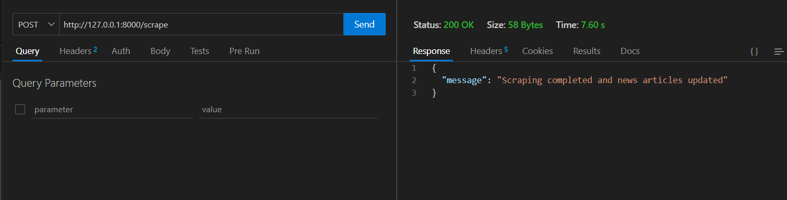
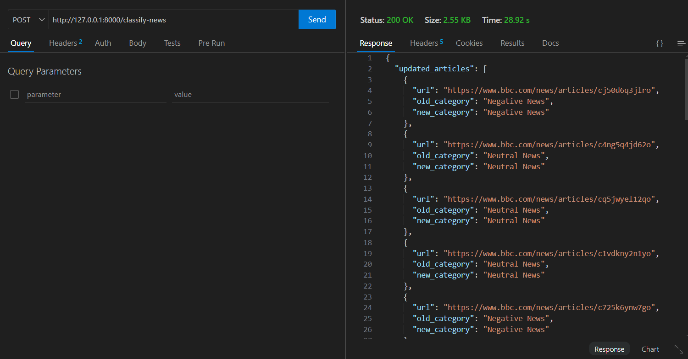
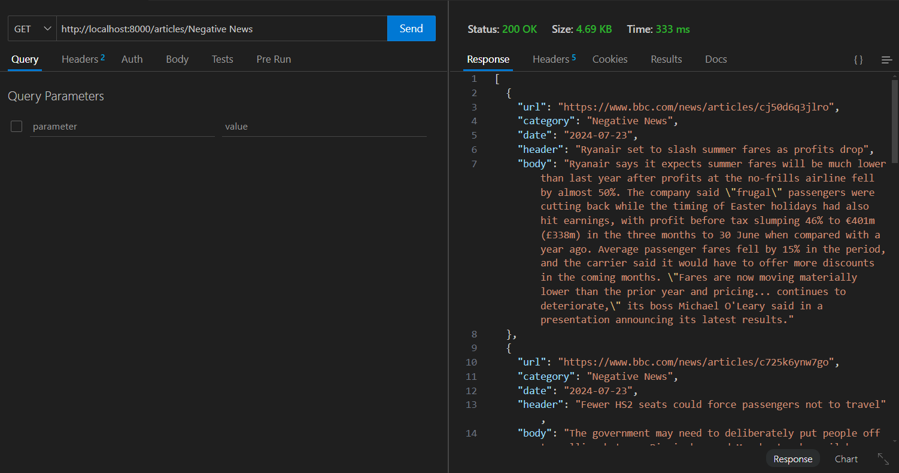
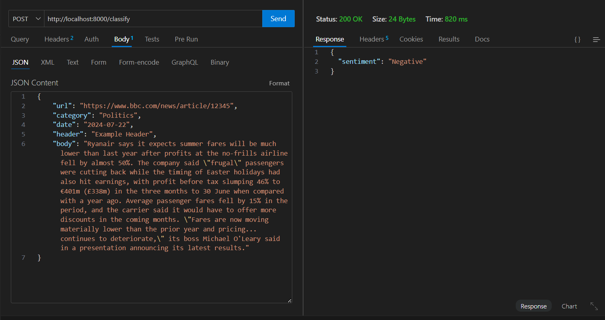

# MarketSentiment

MarketSentiment is a ML tool designed to analyze and classify financial and business news based on sentiment. By leveraging a GRU (Gated Recurrent Unit) based model, it provides accurate sentiment classification, categorizing news articles as Positive, Neutral, or Negative. This empowers investors, analysts, and decision-makers to quickly understand market sentiment and make informed decisions. The project integrates advanced natural language processing techniques and offers a streamlined API for easy access to sentiment analysis.

The backend of MarketSentiment is built using the FastAPI framework, known for its high performance and ease of use. FastAPI is ideal for building APIs with Python, providing asynchronous capabilities that ensure our service can handle multiple requests efficiently and with minimal latency. This robust backend service handles the ingestion of news articles, processes them through the sentiment analysis pipeline, and returns the results via a streamlined API. MongoDB is utilized for data storage, ensuring scalable and flexible management of news articles and their metadata.

## Problem It Solves

- In the fast-paced world of finance and business, staying updated with the latest news and understanding its impact is crucial. However, manually sifting through vast amounts of news to gauge sentiment is time-consuming and inefficient. MarketSentiment automates this process, providing quick and accurate sentiment analysis, thus saving time and offering valuable insights for better decision-making.

What is GRU?
The Gated Recurrent Unit (GRU) is a type of recurrent neural network (RNN) architecture used for sequence data. GRUs are designed to handle the vanishing gradient problem common in traditional RNNs, making them more effective for modeling long-term dependencies in sequential data. GRUs have fewer parameters compared to LSTMs (Long Short-Term Memory networks) but still achieve comparable performance, making them a popular choice for various natural language processing tasks.

## Features

- **Automated Sentiment Analysis:** Automatically classify news articles into Positive, Neutral, or Negative categories.
- **Real-Time Analysis:** Fetch and analyze news articles from reliable sources in real-time.
- **Database Integration:** Store and retrieve news articles with sentiment classifications from MongoDB.
- **FastAPI Integration:** Easily access the sentiment analysis via API endpoints.
- **Scheduler:** Regularly scrape and update news articles for the latest sentiment analysis.

## Workflow Overview

#### 1. Scrape News Articles:
- Triggered automatically daily or manually via the /scrape endpoint.
- Scrapes articles from specified news sources (e.g., BBC News).
- Stores scraped articles in MongoDB.

#### 2.Classify Articles by Sentiment:
- Fetches all articles from MongoDB.
- Applies the sentiment analysis model to classify each article as Positive, Neutral, or Negative
- Updates the sentiment classification in MongoDB.

#### 3.Retrieve Classified Articles:
- Use the api endpoint to retrieve articles based on their sentiment.

#### 4.Predict Sentiment of Custom Text:
- Use the /predict endpoint to predict the sentiment of custom input text.
- The input text is processed and classified using the sentiment analysis model.


## Installation

#### Follow this commands to test this project

#### 1. Clone the repository:

```

```

#### 2. Install the required packages:

```
  pip install -r requirements.txt
```

#### 3. Set up MongoDB:
- Create a MongoDB Atlas account and get the connection URI.
- Set the connection URI in the environment variables.

#### 4. Run the application:
```
uvicorn main:app --reload
```

## Usage:


#### 1.Scrape and Update News Articles in MongoDB
- Method: POST
```
http://localhost:8000/scrape
```


#### 2. classify all Articles stored in MongoDB
- Method: POST
```
http://127.0.0.1:8000/classify-news
```


#### 3. Get News Articles by Sentiment Category
- Method: GET
- categories = ["Positive News", "Negative News", "Neutral News"]

```
http://localhost:8000/articles/?{category}
```


#### 4. customizely classify the Sentiment of a Text/Article
- Method: POST

```
http://localhost:8000/classify
```
- Body format: Json
```
{
    "url": "https://www.bbc.com/news/article/12345",
    "category": "Politics",
    "date": "2024-07-22",
    "header": "Example Header",
    "body": "This is the body of the article that contains text to analyze."
}
```




## Contributing

Contributions are welcome! Please submit a pull request or open an issue to discuss improvements or features.
